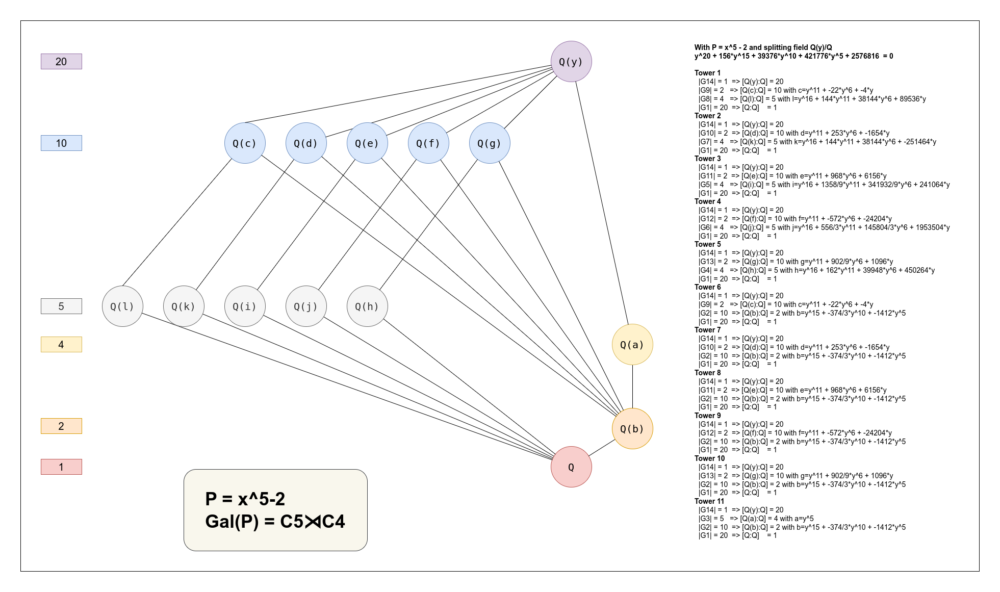

# FastGoat
What C# can do for studying Finite Groups, abelians or not, quotient groups, direct products or semi-direct products, homomorphisms, automorphisms group, with minimalistic manipulations for rings, fields, numbers, polynomials factoring, field extensions, algebraics numbers and many more...

## Example
Searching semi-direct product $C_7 \rtimes C_3$ in $\textbf{S}_7$

```csharp
GlobalStopWatch.Restart();
var s7 = new Sn(7);
var a = s7[(1, 2, 3, 4, 5, 6, 7)];
var allC3 = s7.Where(p => (p ^ 3) == s7.Neutral()).ToArray();
var b = allC3.First(p => Group.GenerateElements(s7, a, p).Count() == 21);
GlobalStopWatch.Stop();

Console.WriteLine("|S7|={0}, |{{b in S7 with b^3 = 1}}| = {1}",s7.Count(), allC3.Count());
Console.WriteLine("First Solution |HK| = 21 : h = {0} and k = {1}", a, b);
Console.WriteLine();

var h = Group.Generate("H", s7, a);
var g21 = Group.Generate("G21", s7, a, b);
DisplayGroup.Head(g21);
DisplayGroup.Head(g21.Over(h));
GlobalStopWatch.Show("Group21");
```

will output

```dotnetcli
|S7|=5040, |{b in S7 with b^3 = 1}| = 351
First Solution |HK| = 21 : h = [(1 2 3 4 5 6 7)] and k = [(2 3 5)(4 7 6)]

|G21| = 21
Type        NonAbelianGroup
BaseGroup   S7

|G21/H| = 3
Type        AbelianGroup
BaseGroup   G21/H
Group           |G21| = 21
NormalSubGroup  |H| = 7

# Group21 Time:113 ms
```

## Another Example
Comparing the previous results with the group presented by $\langle (a,\ b) \ | \ a^7=b^3=1,\ a^2=bab^{-1} \rangle$

```csharp
GlobalStopWatch.Restart();
var wg = new WordGroup("a7, b3, a2 = bab-1");
GlobalStopWatch.Stop();

DisplayGroup.Head(wg);
var n = Group.Generate("<a>", wg, wg["a"]);
DisplayGroup.Head(wg.Over(n));
GlobalStopWatch.Show($"{wg}");
Console.WriteLine();
```

will produce

```dotnetcli
|WG[a,b]| = 21
Type        NonAbelianGroup
BaseGroup   WG[a,b]

|WG[a,b]/<a>| = 3
Type        AbelianGroup
BaseGroup   WG[a,b]/<a>
Group           |WG[a,b]| = 21
NormalSubGroup  |<a>| = 7

# WG[a,b] Time:42 ms
```

## Semidirect product using group action

Another way for the previous example
```csharp
GlobalStopWatch.Restart();
var c7 = new Cn(7);
var c3 = new Cn(3);
var g21 = Group.SemiDirectProd(c7, c3);
GlobalStopWatch.Stop();

var n = Group.Generate("N", g21, g21[1, 0]);
DisplayGroup.HeadSdp(g21);
DisplayGroup.Head(g21.Over(n));
GlobalStopWatch.Show("Group21");
```
will output
```dotnetcli
|C7 x: C3| = 21
Type        NonAbelianGroup
BaseGroup    C7 x C3
NormalGroup  |C7| = 7
ActionGroup  |C3| = 3

Action FaithFull
g=0 y(g) = (0->0, 1->1, 2->2, 3->3, 4->4, 5->5, 6->6)
g=1 y(g) = (0->0, 1->2, 2->4, 3->6, 4->1, 5->3, 6->5)
g=2 y(g) = (0->0, 1->4, 2->1, 3->5, 4->2, 5->6, 6->3)

|(C7 x: C3)/N| = 3
Type        AbelianGroup
BaseGroup   (C7 x: C3)/N
Group           |C7 x: C3| = 21
NormalSubGroup  |N| = 7

# Group21 Time:1 ms
```

## Characters Table

Displaying characters table for the group $C_7 \rtimes C_3$ in $\textbf{S}_7$

```csharp
FG.CharacterTable(g21).DisplayCells();
```
will output
```dotnetcli
|C7 x: C3| = 21
Type        NonAbelianGroup
BaseGroup   C7 x C3

[Class      1   3a   3b              7a              7b]
[ Size      1    7    7               3               3]
[                                                      ]
[  Ꭓ.1      1    1    1               1               1]
[  Ꭓ.2      1   ξ3  ξ3²               1               1]
[  Ꭓ.3      1  ξ3²   ξ3               1               1]
[  Ꭓ.4      3    0    0  -1/2 - 1/2·I√7  -1/2 + 1/2·I√7]
[  Ꭓ.5      3    0    0  -1/2 + 1/2·I√7  -1/2 - 1/2·I√7]
All i,                 Sum[g](Xi(g)Xi(g^−1)) = |G|      : True
All i <> j,            Sum[g](Xi(g)Xj(g^−1)) =  0       : True
All g, h in Cl(g),     Sum[r](Xr(g)Xr(h^−1)) = |Cl(g)|  : True
All g, h not in Cl(g), Sum[r](Xr(g)Xr(h^−1)) =  0       : True

```

## Polynomial with Galois group 

Computing Galois Group of irreductible polynomial $P=X^7-8X^5-2X^4+16X^3+6X^2-6X-2$ from [GroupName](https://people.maths.bris.ac.uk/~matyd/GroupNames/1/C7sC3.html) website

```csharp
Ring.DisplayPolynomial = MonomDisplay.StarCaret;
var x = FG.QPoly('X');
var P = x.Pow(7) - 8 * x.Pow(5) - 2 * x.Pow(4) + 16 * x.Pow(3) + 6 * x.Pow(2) - 6 * x - 2; // GroupNames website
GaloisApplicationsPart2.GaloisGroupChebotarev(P, details: true);
```
will output
```dotnetcli
f = X^7 - 8*X^5 - 2*X^4 + 16*X^3 + 6*X^2 - 6*X - 2
Disc(f) = 1817487424 ~ 2^6 * 73^4
#1   P = 3 shape (7)
#2   P = 5 shape (1, 3, 3)
#3   P = 7 shape (7)
#4   P = 11 shape (1, 3, 3)
#5   P = 13 shape (1, 3, 3)
#6   P = 17 shape (7)
#7   P = 19 shape (1, 3, 3)
#8   P = 23 shape (1, 3, 3)
#9   P = 29 shape (1, 3, 3)
#10  P = 31 shape (1, 3, 3)
actual types
    [(7), 3]
    [(1, 3, 3), 7]
expected types
    [(7), 6]
    [(1, 3, 3), 14]
    [(1, 1, 1, 1, 1, 1, 1), 1]
Distances
    { Name = F_21(7) = 7:3, order = 21, dist = 0.6666666666666664 }
    { Name = F_42(7) = 7:6, order = 42, dist = 8.8 }
    { Name = L(7) = L(3,2), order = 168, dist = 25.6 }
    { Name = A7, order = 2520, dist = 380 }
    { Name = S7, order = 5040, dist = 538.6666666666666 }

P = X^7 - 8*X^5 - 2*X^4 + 16*X^3 + 6*X^2 - 6*X - 2
Gal(P) = F_21(7) = 7:3
|F_21(7) = 7:3| = 21
Type        NonAbelianGroup
BaseGroup   S7
SuperGroup  |Symm7| = 5040
```

# Galois Theory

Galois Group of polynomial $P = X^5 + X^4 - 4X^3 - 3X^2 + 3X + 1$

```csharp
Ring.DisplayPolynomial = MonomDisplay.StarCaret;
var x = FG.QPoly('X');
var P = x.Pow(5) + x.Pow(4) - 4 * x.Pow(3) - 3 * x.Pow(2) + 3 * x + 1;
var roots = IntFactorisation.AlgebraicRoots(P, details: true);
var gal = GaloisTheory.GaloisGroup(roots, details: true);
DisplayGroup.AreIsomorphics(gal, FG.Abelian(5));
```

will output
```dotnetcli
[...]

f = X^5 + X^4 - 4*X^3 - 3*X^2 + 3*X + 1 with f(y) = 0
Square free norm : Norm(f(X + 2*y)) = x^25 - 5*x^24 - 98*x^23 + 503*x^22 + 3916*x^21 - 20988*x^20 - 82808*x^19 + 476245*x^18 + 1001759*x^17 - 6482223*x^16 - 6888926*x^15 + 55077950*x^14 + 23535811*x^13 - 295014199*x^12 - 8852570*x^11 + 984611573*x^10 - 207998384*x^9 - 1981105500*x^8 + 676565912*x^7 + 2253157335*x^6 - 871099834*x^5 - 1278826318*x^4 + 467945878*x^3 + 268636799*x^2 - 89574789*x + 1746623
         = (x^5 - x^4 - 26*x^3 + 47*x^2 + 47*x - 1) * (x^5 - x^4 - 26*x^3 + 25*x^2 + 91*x - 67) * (x^5 - x^4 - 26*x^3 + 25*x^2 + 157*x - 199) * (x^5 - x^4 - 26*x^3 - 19*x^2 + 113*x + 131) * (x^5 - x^4 - 4*x^3 + 3*x^2 + 3*x - 1)

X^5 + X^4 - 4*X^3 - 3*X^2 + 3*X + 1 = (X + y^4 + y^3 - 3*y^2 - 2*y + 1) * (X - y^4 + 4*y^2 - 2) * (X - y^3 + 3*y) * (X - y^2 + 2) * (X - y)
Are equals True

Polynomial P = X^5 + X^4 - 4*X^3 - 3*X^2 + 3*X + 1
Factorization in Q(α)[X] with P(α) = 0
    X - α
    X - α^2 + 2
    X - α^3 + 3*α
    X + α^4 + α^3 - 3*α^2 - 2*α + 1
    X - α^4 + 4*α^2 - 2

|Gal( Q(α)/Q )| = 5
Type        AbelianGroup
BaseGroup   S5

Elements
(1)[1] = []
(2)[5] = [(1 2 5 3 4)]
(3)[5] = [(1 3 2 4 5)]
(4)[5] = [(1 4 3 5 2)]
(5)[5] = [(1 5 4 2 3)]

Gal( Q(α)/Q ) IsIsomorphicTo C5 : True

```

Computing $\bf{Gal}(\mathbb{Q}(\sqrt{2}, \sqrt{3})/\mathbb{Q})=\mathbf{C_2}\times\mathbf{C_2}$

```csharp
Ring.DisplayPolynomial = MonomDisplay.Caret;
var x = FG.QPoly('X');
var (X, _) = FG.EPolyXc(x.Pow(2) - 2, 'a');
var (minPoly, a0, b0) = IntFactorisation.PrimitiveElt(X.Pow(2) - 3);
var roots = IntFactorisation.AlgebraicRoots(minPoly);
Console.WriteLine("Q(√2, √3) = Q(α)");
var gal = GaloisTheory.GaloisGroup(roots, details: true);
DisplayGroup.AreIsomorphics(gal, FG.Abelian(2, 2));
```

will output
```dotnetcli
Q(√2, √3) = Q(α)
Polynomial P = X^4 - 10*X^2 + 1
Factorization in Q(α)[X] with P(α) = 0
    X + α
    X - α
    X + α^3 - 10*α
    X - α^3 + 10*α

|Gal( Q(α)/Q )| = 4
Type        AbelianGroup
BaseGroup   S4

Elements
(1)[1] = []
(2)[2] = [(1 2)(3 4)]
(3)[2] = [(1 3)(2 4)]
(4)[2] = [(1 4)(2 3)]

Gal( Q(α)/Q ) IsIsomorphicTo C2 x C2 : True

```


With $\alpha^4-2 = 0,\ \bf{Gal}(\mathrm{Q}(\alpha, \mathrm{i})/\mathrm{Q}) = \mathbf{D_4}$
```csharp
Ring.DisplayPolynomial = MonomDisplay.Caret;
var x = FG.QPoly('X');
var (X, i) = FG.EPolyXc(x.Pow(2) + 1, 'i');
var (minPoly, _, _) = IntFactorisation.PrimitiveElt(X.Pow(4) - 2);
var roots = IntFactorisation.AlgebraicRoots(minPoly);
Console.WriteLine("With α^4-2 = 0, Q(α, i) = Q(β)");
var gal = GaloisTheory.GaloisGroup(roots, primEltChar: 'β', details: true);
DisplayGroup.AreIsomorphics(gal, FG.Dihedral(4));
```

will output
```dotnetcli
With α^4-2 = 0, Q(α, i) = Q(β)
Polynomial P = X^8 + 4*X^6 + 2*X^4 + 28*X^2 + 1
Factorization in Q(β)[X] with P(β) = 0
    X + β
    X - β
    X + 5/12*β^7 + 19/12*β^5 + 5/12*β^3 + 139/12*β
    X + 5/24*β^7 - 1/24*β^6 + 19/24*β^5 - 5/24*β^4 + 5/24*β^3 - 13/24*β^2 + 127/24*β - 29/24
    X + 5/24*β^7 + 1/24*β^6 + 19/24*β^5 + 5/24*β^4 + 5/24*β^3 + 13/24*β^2 + 127/24*β + 29/24
    X - 5/24*β^7 - 1/24*β^6 - 19/24*β^5 - 5/24*β^4 - 5/24*β^3 - 13/24*β^2 - 127/24*β - 29/24
    X - 5/24*β^7 + 1/24*β^6 - 19/24*β^5 + 5/24*β^4 - 5/24*β^3 + 13/24*β^2 - 127/24*β + 29/24
    X - 5/12*β^7 - 19/12*β^5 - 5/12*β^3 - 139/12*β

|Gal( Q(β)/Q )| = 8
Type        NonAbelianGroup
BaseGroup   S8

Elements
(1)[1] = []
(2)[2] = [(1 2)(3 8)(4 7)(5 6)]
(3)[2] = [(1 3)(2 8)(4 6)(5 7)]
(4)[2] = [(1 4)(2 6)(3 7)(5 8)]
(5)[2] = [(1 5)(2 7)(3 6)(4 8)]
(6)[2] = [(1 8)(2 3)(4 5)(6 7)]
(7)[4] = [(1 6 8 7)(2 4 3 5)]
(8)[4] = [(1 7 8 6)(2 5 3 4)]

Gal( Q(β)/Q ) IsIsomorphicTo D8 : True
```

## Illustration



## References

[ALGÈBRE T1](https://laboutique.edpsciences.fr/produit/63/9782759803316/)
<b>Daniel Guin, Thomas Hausberger.</b>
ALGÈBRE T1 Groupes, corps et théorie de Galois.
EDP Sciences.
<i>All Chapters.</i>

[Algebra (3rd ed.)](https://bookstore.ams.org/chel-330/)
<b>Saunders MacLane, Garrett Birkhoff.</b>
Algebra (3rd ed.).
American Mathematical Society.
<i>Chapter XII.2 Groups extensions.</i>

[A Course on Finite Groups](https://link.springer.com/book/10.1007/978-1-84882-889-6)
<b>H.E. Rose.</b>
A Course on Finite Groups.
Springer. 2009.
<i>All Chapters. Web Sections, Web Chapters.</i>

[A Course on Finite Groups](https://link.springer.com/book/10.1007/978-1-84882-889-6)
<b>H.E. Rose.</b>
A Course on Finite Groups.
Web Sections, Web Chapters and Solution Appendix.
Springer. 2009.
<i>Chapter 13. Representation and Character Theory.</i>

[GroupNames](https://people.maths.bris.ac.uk/~matyd/GroupNames/index.html)
<b>Tim Dokchitser.</b>
Group Names.
<i>Beta</i>

[GAP2022](https://www.gap-system.org)
<b>The GAP Group.</b>
GAP -- Groups, Algorithms, and Programming.
<i>Version 4.12.0; 2022.</i>

[Paper (pdf)](http://www.math.cornell.edu/~kbrown/7350/toddcox.pdf)
<b>Ken Brown.</b>
Mathematics 7350.
Cornell University.
<i>The Todd–Coxeter procedure</i>

[Conway polynomials](http://www.math.rwth-aachen.de/~Frank.Luebeck/data/ConwayPol/index.html)
<b>Frank Lübeck.</b>
Conway polynomials for finite fields
<i>Online data</i>

[AECF](https://hal.archives-ouvertes.fr/AECF/)
<b>Alin Bostan, Frédéric Chyzak, Marc Giusti, Romain Lebreton, Grégoire Lecerf, Bruno Salvy, Éric Schost.</b>
Algorithmes Efficaces en Calcul Formel.
Édition web 1.1, 2018
<i>Chapitre IV Factorisation des polynômes.</i>

[hal-01444183](https://hal.archives-ouvertes.fr/hal-01444183)
<b>Xavier Caruso</b>
Computations with p-adic numbers. Journées Nationales de Calcul Formel, In press,
Les cours du CIRM. 2017.
<i>Several implementations of p-adic numbers</i>

[Algebraic Factoring](https://dl.acm.org/doi/10.1145/800205.806338)
<b>Barry Trager</b>
Algebraic Factoring and Rational Function Integration.
Laboratory for Computer Science, MIT. 1976.
<i>Norms and Algebraic Factoring</i>

[Bases de Gröbner](https://www.cristal.univ-lille.fr/jncf2015/files/lecture-notes/faugere.pdf)
<b>Jean-Charles Faugere</b>
Résolution des systèmes polynômiaux en utilisant les bases de Gröbner.
INRIA (POLSYS) / UPMC / CNRS/ LIP6.
<i>(JNCF) 2015</i>

[Ideals, Varieties, and Algorithms](https://doi.org/10.1007/978-3-319-16721-3)
<b>David A. Cox, John Little, Donal O’Shea</b>
Ideals, Varieties, and Algorithms.
Springer. 4th Edition. 2015.
<i>Chapter 5. Polynomial and Rational Functions on a Variety</i>

[Charaktertheorie](https://www.mathematik.uni-kl.de/~lassueur/en/teaching/CTFGSS20/)
<b>Jun.-Prof. Dr. Caroline Lassueur</b>
Character Theory of Finite Groups.
TU Kaiserslautern, SS2020.
<i>Chapter 6. Induction and Restriction of Characters</i>

[Wikipedia](https://www.wikipedia.org/)
<b>Wikipedia.</b>
The Free Encyclopedia.
<i>Many algorithms and proofs</i>

[WolframCloud](https://mathematica.wolframcloud.com/)
<b>Wolfram Research.</b>
WOLFRAM CLOUD Integrated Access to Computational Intelligence
<i>2023 Wolfram Research, Inc.</i>

[Pari/GP](http://pari.math.u-bordeaux.fr/)
<b>The PARI Group.</b>
PARI/GP Number Theory-oriented Computer Algebra System.
Bordeaux.
<i>Version 2.15.x; 2020-2022.</i>

[milneFT](https://www.jmilne.org/math/CourseNotes/ft.html)
<b>Milne, James S.</b>
Fields and Galois Theory.
Ed web v5.10, 2022.
<i>Chapter 4. Computing Galois Groups.</i>

[ChatGPT](https://chat.openai.com/)
<b>OpenAI.</b>
ChatGPT
August 3, 2023
Version3.5
<i>Free Research Preview.</i>

[fplll](https://fplll.github.io/fplll/)
<b>The FPLLL development team.</b>
A lattice reduction library
may2021
Version 5.4.1

[arb](https://arblib.org/index.html)
<b>F.Johansson</b>
Arb a C library for arbitrary-precision ball arithmetic
june2022
Version 2.23

[milneCFT](https://www.jmilne.org/math/CourseNotes/cft.html)
<b>Milne, James S.</b>
Class Field Theory.
Ed web v4.03, 2020.
<i>Chapter 2. The Cohomology of Groups.</i>

[Cohomology of Finite Groups](https://link.springer.com/book/10.1007/978-3-662-06280-7)
<b>Alejandro Adem, R. James Milgram.</b>
Cohomology of Finite Groups Springer.
Second Edition 2004. 
<i>Chapter 1. Group Extensions, Simple Algebras and Cohomology</i>

[arXiv:math/0010134](https://arxiv.org/abs/math/0010134)
<b>Florentin Smarandache, PhD Associate Professor Chair of Department of Math & Sciences</b>
INTEGER ALGORITHMS TO SOLVE DIOPHANTINE LINEAR EQUATIONS AND SYSTEMS.
University of New Mexico nov 2007.

[RSW1999](https://www.aidansims.com/papers/RSW1999.pdf)
<b>Iain Raeburn, Aidan Sims, and Dana P.Williams</b>
TWISTED ACTIONS AND OBSTRUCTIONS IN GROUP COHOMOLOGY.
Germany, March 8–12, 1999.
